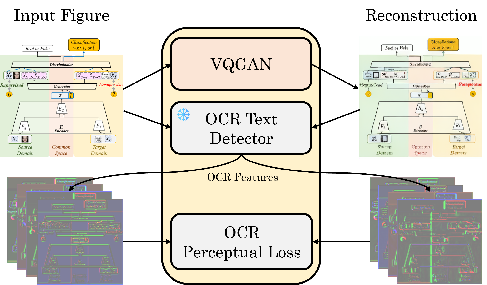
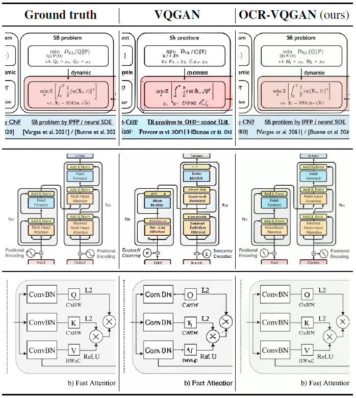
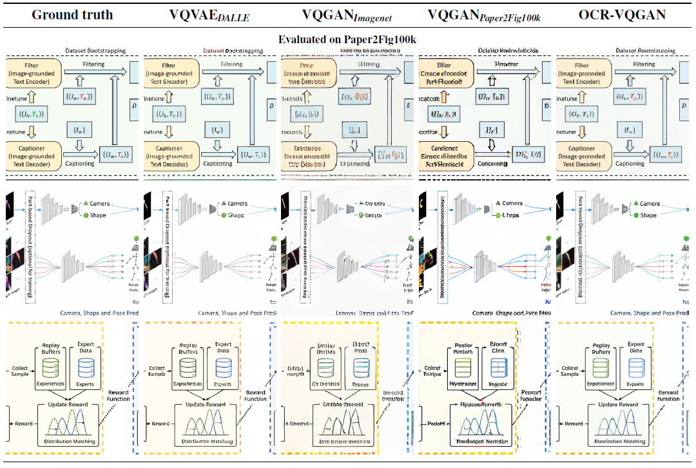

# OCR-VQGAN @WACV 2023 🏝️

## [OCR-VQGAN: Taming Text-within-Image Generation](https://arxiv.org/abs/2210.11248)

[](https://arxiv.org/abs/2210.11248)

[Juan A. Rodríguez](https://scholar.google.es/citations?user=0selhb4AAAAJ&hl=en), [David Vázquez](https://scholar.google.es/citations?user=1jHvtfsAAAAJ&hl=en), [Issam Laradji](https://scholar.google.ca/citations?user=8vRS7F0AAAAJ&hl=en), [Marco Pedersoli](https://scholar.google.com/citations?user=aVfyPAoAAAAJ&hl=en), [Pau Rodríguez](https://scholar.google.com/citations?user=IwBx73wAAAAJ)

-----------
[Computer Vision Center, Autonomous University of Barcelona](http://www.cvc.uab.es/)

[ServiceNow Research, Montréal, Canada](https://www.servicenow.com/research/)

[ÉTS Montreal, University of Québec](https://www.etsmtl.ca/)

------------------
OCR-VQGAN is an image encoder designed to generate images that display clear and readable text. We propose to add an **OCR perceptual loss** term to the overall VQGAN loss, that encourages the learned discrete latent space to encode text patterns (i.e. learn rich latent representations to decode clear text-within-images). 

We experiment with OCR-VQGAN in and a novel dataset of images of figures and diagrams from research papers, called [**Paper2Fig100k dataset**](https://zenodo.org/record/7299423#.Y2lzonbMKUl). We find that using OCR-VQGAN to encode images in Paper2Fig100k results in much better figure reconstructions.

This code is adapted from **VQGAN** at [CompVis/taming-transformers](https://github.com/CompVis/taming-transformers), and [CompVis/stable-diffusion](https://github.com/CompVis/stable-diffusion). The OCR detector model used in OCR Perceptual loss is the **CRAFT** model from [clovaai/CRAFT-pytorch](https://github.com/clovaai/CRAFT-pytorch).

<p align="center">
  <a href="https://arxiv.org/abs/2209.xxxx"></a>
</p>

**Abstract**
>Synthetic image generation has recently experienced significant improvements in domains such as natural image or
art generation. However, the problem of figure and diagram generation remains unexplored. A challenging aspect of generating figures and diagrams is effectively rendering readable texts within the images. To alleviate this problem, we present OCR-VQGAN, an image encoder, and decoder that leverages OCR pre-trained features to optimize a text perceptual loss, encouraging the architecture to preserve
high-fidelity text and diagram structure. To explore our approach, we introduce the Paper2Fig100k dataset, with over 100k images of figures and texts from research papers. The figures show architecture diagrams and methodologies of articles available at arXiv.org from fields like artificial intelligence and computer vision. Figures usually include text and discrete objects, e.g., boxes in a diagram, with lines and arrows that connect them. We demonstrate the superiority of our method by conducting several experiments on the task of figure reconstruction. Additionally, we explore the qualitative and quantitative impact of weighting different perceptual metrics in the overall loss function.

## Installation
Create a [conda](https://conda.io/) environment named `ocr-vqgan`,
and activate with:

```bash
conda env create -f environment.yaml
conda activate ocr-vqgan
pip install -e .
```

## How to use OCR Perceptual loss and OCR Similarity
Because we are working with images of figures (i.e., images are non-natural), a VGG perceptual loss (LPIPS) is not enough to effectively encode and decode clear texts and sharp diagrams. We propose an additional [**OCR perceptual loss**](https://arxiv.org/abs/2210.11248) to encourage vqgan to learn a rich latent space and reconstruct clear and readable text-within-images.

The OCR perceptual loss can be computed as follows. You can pass a pair of input and reconstructed images (using any type of image encoder/decoder):

```python
from taming.modules.losses.lpips import OCR_CRAFT_LPIPS
from PIL import Image
import numpy as np
import torchvision.transforms as T
import torch

def get_image_tensor(image_path):
    image = Image.open(image_path)
    if not image.mode == "RGB":
        image = image.convert("RGB")
    image = np.array(image).astype(np.uint8)
    image = (image/127.5 - 1.0).astype(np.float32)
    return torch.unsqueeze(T.ToTensor()(image), 0)

# Load image and reconstruction to tensors
input_path = 'assets/original.png'
recons_path = 'assets/reconstruction.png'

input_tensor = get_image_tensor(input_path).cuda()
rec_tensor = get_image_tensor(recons_path).cuda()

OCR_perceptual_loss = OCR_CRAFT_LPIPS().eval()
OCR_perceptual_loss.cuda()

ocr_sim = OCR_perceptual_loss(input_tensor, rec_tensor)
```

Our OCR-VQGAN method uses OCR perceptual loss as an additional term in the overall VQGAN loss (see [VQLPIPSWithDiscriminatorOCR](https://github.com/joanrod/ocr-vqgan/blob/bd122c0b7ae02a59c87e568aab72d1e82b754973/taming/modules/losses/vqperceptual.py#L139)).

----------------------

## Training OCR-VQGANs

Logs and checkpoints for experiments are saved into a `logs` directory. By default, this directory will be created inside the project, but we recommend passing the argument `-l dir_path` with a path where you have sufficient disck space. 

### Download Paper2Fig100k dataset

We train our models using Paper2Fig100k dataset, that can be downloaded [here](https://zenodo.org/record/7299423#.Y2lv7nbMKUk). Once downloaded, you will find the following structure:

```
📂Paper2Fig100k/
├── 📂figures
│   ├── 🖼️1001.1968v1-Figure1-1.png
│   ├── 🖼️1001.1988v1-Figure1-1.png
│   ├── ...
├── 📜paper2fig_train.json
├── 📜paper2fig_test.json

```

The directory `figures` contain all images in the dataset, and the train and test JSON files define the metadata about each figure (id, captions, etc.). Run the following command to prepare Paper2Figure samples for the OCR-VQGAN training:

```bash
python scripts/parse_paper2fig1_img_to_VQGAN.py --path <path_Paper2Fig100k_root>
```

### Download ICDAR 13
We also use ICDAR 13 to evaluate OCR-VQGAN. [Download ICDAR13 dataset](https://rrc.cvc.uab.es/?ch=2&com=downloads)(train and test sets). Create a root directory `ICDAR13` and add both downloaded sets.

```
📂ICDAR13/
├── 📂Challenge2_Test_Task12_Images
├── 📂Challenge2_Training_Task12_Images
```

Run the following command to prepare images for evaluation with OCR-VQGAN.

```bash
python scripts/parse_ICDAR2013_img_to_VQGAN.py --path <path_ICDAR13_dataset>
```

This will create a .txt file with the paths of the images in ICDAR13 (we unify both splits for validation).

-----------------

### Training OCR-VQGAN from scratch 

Create a new configuration for your model using a `config.yaml` file, or use one from the folder `configs`. Using these as `--base` will create new experiment directory using base configurations, to store checkpoints and configs. 

You need to modify the `training_images_list_file` and `test_images_list_file` `inside the config.yaml` file (inside `data`), to point at the .txt files that contain paths to images:
```yaml
data:
  target: main.DataModuleFromConfig
  params:
    ...
    train:
      target: taming.data.custom.CustomTrain
      params:
        training_images_list_file: <data_path>/paper2fig_train.txt
        ...
    validation:
      target: taming.data.custom.CustomTest
      params:
        test_images_list_file: <data_path>/paper2fig1_img_test.txt
        ...
    test:
      target: taming.data.custom.CustomTest
      params:
        test_images_list_file: <data_path>/paper2fig1_img_test.txt
        ...
```

Then run the following command to start training. You mey need to [configure wandb](https://docs.wandb.ai/quickstart):

```bash
python main.py --base configs/<config_spec>.yaml --logdir path_to_logdir -t --gpus 0, -p <project_name>
```
----------------------

### Fine-tuning pre-trained VQGANs with Paper2Fig100k 🚀

You can also start with VQGAN pre-trained weights and fine-tune the model with Figures from PaperFig100k. There are are several VQGAN pre-trained models in [this model zoo](https://github.com/CompVis/latent-diffusion#model-zoo). For instance, we will resume from `vqgan_imagenet_16384` model available [here](https://heibox.uni-heidelberg.de/d/a7530b09fed84f80a887/). The steps are the following:

  1. Create a directory for the new experiment. Create the `configs` and `checkpoints` directories, and add the `ocr-vqgan/configs/ocr-vqgan-imagenet-16384.yaml` and `last.ckpt` as,
   
  ```
  📂vqgan_imagenet_16384_paper2fig/
  ├── 📂configs
  |   ├── 📜ocr-vqgan-imagenet-16384.yaml
  ├── 📂checkponts
  |   ├── 📜last.ckpt
  ```

  2. Running the following command will automatically load the `last.ckpt` weights:

  ```bash
  python main.py -r <path>/vqgan_imagenet_16384_paper2fig -t --gpus 0, -p <project_name>
  ```
  or resume from a specific checkpont with:

  ```bash
  python main.py -r <path>/model.ckpt -t --gpus 0,
  ```

>NOTE: The first time that the training is executed, it will crash because the OCR weights are not in the pre-trained model. However, during the crash, it will update the `last.ckpt` checkpoint inside `checkpoints`. The nest run will use that checkpoint and will work fine.
---------------------------

## Evaluation of OCR-VQGAN 

The evaluation of OCR-VQGAN consists in computing quantitative metrics for **LPIPS** and **OCR Similarity** (Check the proposed metric in the [paper](https://arxiv.org/abs/2210.11248)) in a test epoch. This process also stores reconstructions in a `evaluation` directory.

```bash
python main.py -r dir_model --gpus 0
```
### Computing FID, SSIM and Qualitative results

#### Prepare test images
Before computing FID and SSIM metrics, we need to process test samples so that they are all inside a directory and center-cropped.

```bash
python prepare_eval_samples.py --image_txt_path <path to txt file> --store_path <path_output_dir>
```

where `--image_txt_path` indicates here the txt file is located and `--store_path` defines the folder to store results.
#### Compute FID

FID is a metric to measure the similarity of two sets of images in terms of their data distribution. It is computed using full batches of images, not one by one. FID extracts InceptionV3 features of all the images, and computes the similarity using the mean and stdv of features. We use [torch-fidelity](https://github.com/toshas/torch-fidelity) library to compute FID between the sets defined by `--input1` and `--input2`.

```bash
pip install torch-fidelity #should be already installed
fidelity --gpu 0 --fid --input1 test_samples_dir --input2 evaluation_samples_dir
```
#### Compute SSIM
Similarly, we propose to compute SSIM scores by passing two sets of images (input and reconstruction sets), again defining the sets as `--input1` and `--input2`.

```bash
python --input1 test_samples_dir --input2 evaluation_samples_dir
```

>This script does not use GPU, but we use multiprocessing to accelerate the computation. For 20k images, and 32 CPU cores it takes around 7 minutes.

#### Extract qualitative results
Extract random validation samples from different models (qualitatively evaluate the same sample from different methods).
```bash
python generate_qualitative_results.py --test_dataset dir_original__samples\
                 --VQGAN_pretrained dir_VQVAE_samples\
                 --VQGAN_finetuned dir_VQVAE_samples\
                 --OCR_VQGAN dir_VQVAE_samples\
```
------------


### Results and models
We provide quantitative and qualitative results of our model, and [links to download](https://zenodo.org/record/7299220#.Y2kr0XbMKUk). Config files in yaml format are available at `configs`. The model is defined by `f`, the downsampling factor, `Z`, the discrete codebook size, and `d`, the model embedding size.

| Model | LPIPS | OCR SIM   |FID           | SSIM    | Link                                                                                                                                                  | Config              |
|-----------------|------------|-------|----------------|---------------|-------------------------------------------------------------------------------------------------------------------------------------------------------|-----------------------|
| f=16, Z=16384, d=256   | 0.08 | 0.45 | 2.02 | 0.77 | [download](https://zenodo.org/record/7299220/files/ocr-vqgan-f16-c16384-d256.zip?download=1) | configs/ocr-vqgan-f16-c16384-d256.yaml |

------------------------

<p align="center">
  <a href="https://arxiv.org/abs/2210.11248"></a>
</p>

<p align="center">
  <a href="https://arxiv.org/abs/2210.11248"></a>
</p>

>More details in our [paper](https://arxiv.org/abs/2210.11248)

## Related work

**[Taming Transformers for High-Resolution Image Synthesis](https://arxiv.org/abs/2012.09841) by Esser et al, CVPR 2021.**

**[High-Resolution Image Synthesis with Latent Diffusion Models](https://arxiv.org/abs/2112.10752) by Rombach et al, CVPR 2022 Oral.**

**[Character Region Awareness for Text Detection](https://arxiv.org/abs/1904.01941) by Baek et al, CVPR 2019.**

-----------------

## Citation
```bibtex
@misc{rodriguez2021ocrvqgan,
    title   = {OCR-VQGAN: Taming Text-within-Image Generation}, 
    author  = {Rodriguez, Juan A. and Vazquez, David and Laradji, Issam and Pedersoli, Marco and Rodriguez, Pau},
    year    = {2022},
    eprint  = {2210.11248},
    archivePrefix = {arXiv},
    primaryClass = {cs.CV}
}
```

## Contact
Juan A. Rodríguez (joanrg.ai@gmail.com). **We welcome collaborators!** so don't hesitate to ask us about the project.
